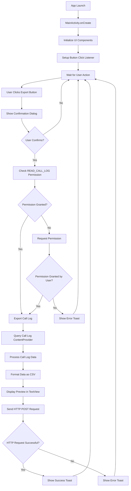
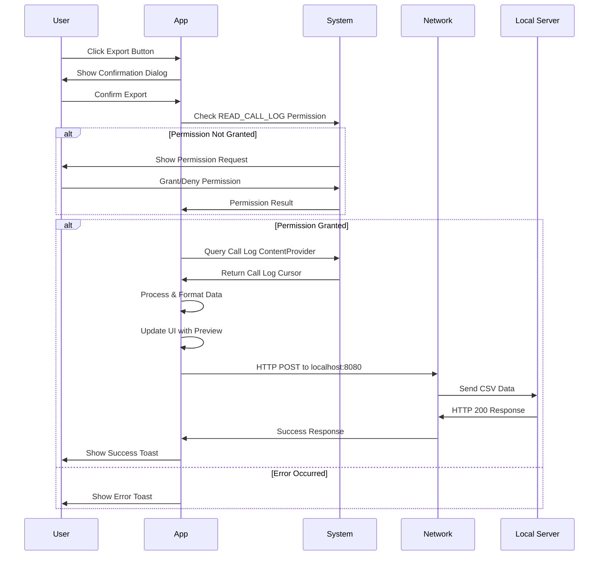

# Call Log Export Android Application

## 📱 Project Overview

**Call Log Export** is an Android application built in Kotlin that securely exports call history data from Android devices and transmits it to a local server. The application prioritizes user consent and transparency by requesting explicit permission before accessing sensitive call log information.

### 🎯 Key Features

- **Secure Call Log Access**: Requests runtime permissions for call log data
- **User Consent**: Explicit confirmation dialog before data export
- **CSV Format Export**: Structured data export in CSV format
- **Network Transmission**: Sends data to local server via HTTP POST
- **Real-time Display**: Shows exported data preview in the app
- **Error Handling**: Comprehensive error reporting and user feedback

---

## 📐 Architecture Overview

```
┌─────────────────────────────────────────────────────────────┐
│                    ANDROID APPLICATION                       │
├─────────────────────────────────────────────────────────────┤
│  ┌─────────────────┐    ┌──────────────────┐               │
│  │   MainActivity  │    │   UI Components  │               │
│  │                 │    │                  │               │
│  │ ┌─────────────┐ │    │ ┌─────────────┐  │               │
│  │ │Permission   │ │    │ │ TextView    │  │               │
│  │ │Management   │ │    │ │ (tvOutput)  │  │               │
│  │ └─────────────┘ │    │ └─────────────┘  │               │
│  │                 │    │                  │               │
│  │ ┌─────────────┐ │    │ ┌─────────────┐  │               │
│  │ │Call Log     │ │    │ │ Button      │  │               │
│  │ │Processing   │ │    │ │ (btnExport) │  │               │
│  │ └─────────────┘ │    │ └─────────────┘  │               │
│  │                 │    │                  │               │
│  │ ┌─────────────┐ │    │ ┌─────────────┐  │               │
│  │ │HTTP Client  │ │    │ │AlertDialog  │  │               │
│  │ │             │ │    │ │             │  │               │
│  │ └─────────────┘ │    │ └─────────────┘  │               │
│  └─────────────────┘    └──────────────────┘               │
└─────────────────────────────────────────────────────────────┘
                            │
                            ▼
┌─────────────────────────────────────────────────────────────┐
│                    ANDROID SYSTEM                           │
├─────────────────────────────────────────────────────────────┤
│  ┌─────────────────┐    ┌──────────────────┐               │
│  │ Permission      │    │ Call Log         │               │
│  │ Manager         │    │ ContentProvider  │               │
│  └─────────────────┘    └──────────────────┘               │
└─────────────────────────────────────────────────────────────┘
                            │
                            ▼
┌─────────────────────────────────────────────────────────────┐
│                    NETWORK LAYER                            │
├─────────────────────────────────────────────────────────────┤
│  HTTP POST → http://10.0.2.2:8080                          │
│  Content-Type: text/csv                                     │
└─────────────────────────────────────────────────────────────┘
                            │
                            ▼
┌─────────────────────────────────────────────────────────────┐
│                    LOCAL SERVER                             │
├─────────────────────────────────────────────────────────────┤
│  Listening on localhost:8080                                │
│  Receives CSV formatted call log data                       │
└─────────────────────────────────────────────────────────────┘
```

---

## 🔄 Application Flow Diagram



---

## 🏗️ Project Structure

```
CallLog/
├── MainActivity.kt          # Main application activity
├── README.md               # This documentation
├── .vscode/                # VS Code configuration
│   └── settings.json
└── .qodo/                  # Qodo configuration (if applicable)
```

### 📁 Required Android Project Structure

To build this as a complete Android project, you'll need:

```
CallLogExport/
├── app/
│   ├── src/
│   │   ├── main/
│   │   │   ├── AndroidManifest.xml
│   │   │   ├── java/com/example/calllogexport/
│   │   │   │   └── MainActivity.kt
│   │   │   └── res/
│   │   │       ├── values/
│   │   │       │   ├── strings.xml
│   │   │       │   └── colors.xml
│   │   │       └── mipmap/
│   │   └── androidTest/
│   ├── build.gradle
│   └── proguard-rules.pro
├── gradle/
├── build.gradle
├── gradle.properties
├── gradlew
├── gradlew.bat
└── settings.gradle
```

---

## ⚙️ Setup and Installation

### Prerequisites

1. **Android Studio** (Arctic Fox or later)
2. **Android SDK** (API level 21 or higher)
3. **Kotlin** support enabled
4. **Android Device or Emulator** with API level 21+
5. **Local Server** running on port 8080

### 🔧 Step-by-Step Setup

#### 1. Create Android Project

```bash
# Open Android Studio
# Create New Project → Empty Activity
# Configure:
# - Application name: Call Log Export
# - Package name: com.example.calllogexport
# - Language: Kotlin
# - Minimum SDK: API 21
```

#### 2. Configure AndroidManifest.xml

Create `app/src/main/AndroidManifest.xml`:

```xml
<?xml version="1.0" encoding="utf-8"?>
<manifest xmlns:android="http://schemas.android.com/apk/res/android"
    package="com.example.calllogexport">

    <!-- Required permissions -->
    <uses-permission android:name="android.permission.READ_CALL_LOG" />
    <uses-permission android:name="android.permission.INTERNET" />

    <application
        android:allowBackup="true"
        android:icon="@mipmap/ic_launcher"
        android:label="@string/app_name"
        android:theme="@style/Theme.AppCompat">
        
        <activity
            android:name=".MainActivity"
            android:exported="true">
            <intent-filter>
                <action android:name="android.intent.action.MAIN" />
                <category android:name="android.intent.category.LAUNCHER" />
            </intent-filter>
        </activity>
        
    </application>
</manifest>
```

#### 3. Configure build.gradle (Module: app)

```gradle
android {
    compileSdk 34

    defaultConfig {
        applicationId "com.example.calllogexport"
        minSdk 21
        targetSdk 34
        versionCode 1
        versionName "1.0"

        testInstrumentationRunner "androidx.test.runner.AndroidJUnitRunner"
    }

    buildTypes {
        release {
            minifyEnabled false
            proguardFiles getDefaultProguardFile('proguard-android-optimize.txt'), 'proguard-rules.pro'
        }
    }
    compileOptions {
        sourceCompatibility JavaVersion.VERSION_1_8
        targetCompatibility JavaVersion.VERSION_1_8
    }
    kotlinOptions {
        jvmTarget = '1.8'
    }
}

dependencies {
    implementation 'androidx.core:core-ktx:1.12.0'
    implementation 'androidx.appcompat:appcompat:1.6.1'
    implementation 'com.google.android.material:material:1.11.0'
    testImplementation 'junit:junit:4.13.2'
    androidTestImplementation 'androidx.test.ext:junit:1.1.5'
    androidTestImplementation 'androidx.test.espresso:espresso-core:3.5.1'
}
```

#### 4. Set up Local Server

Create a simple HTTP server to receive the call log data:

**Python Server Example:**
```python
# server.py
from http.server import HTTPServer, BaseHTTPRequestHandler
import json
from datetime import datetime

class CallLogHandler(BaseHTTPRequestHandler):
    def do_POST(self):
        content_length = int(self.headers['Content-Length'])
        call_log_data = self.rfile.read(content_length).decode('utf-8')
        
        # Save to file with timestamp
        timestamp = datetime.now().strftime("%Y%m%d_%H%M%S")
        filename = f"call_log_{timestamp}.csv"
        
        with open(filename, 'w') as f:
            f.write(call_log_data)
        
        print(f"Call log data saved to {filename}")
        print(f"Data preview:\n{call_log_data[:500]}...")
        
        # Send response
        self.send_response(200)
        self.send_header('Content-type', 'text/plain')
        self.end_headers()
        self.wfile.write(b'Call log received successfully')

if __name__ == '__main__':
    server = HTTPServer(('localhost', 8080), CallLogHandler)
    print("Server running on http://localhost:8080")
    server.serve_forever()
```

**Node.js Server Example:**
```javascript
// server.js
const http = require('http');
const fs = require('fs');

const server = http.createServer((req, res) => {
    if (req.method === 'POST') {
        let data = '';
        
        req.on('data', chunk => {
            data += chunk;
        });
        
        req.on('end', () => {
            const timestamp = new Date().toISOString().replace(/[:.]/g, '-');
            const filename = `call_log_${timestamp}.csv`;
            
            fs.writeFileSync(filename, data);
            console.log(`Call log data saved to ${filename}`);
            console.log(`Data preview:\n${data.substring(0, 500)}...`);
            
            res.writeHead(200, { 'Content-Type': 'text/plain' });
            res.end('Call log received successfully');
        });
    } else {
        res.writeHead(404, { 'Content-Type': 'text/plain' });
        res.end('Not found');
    }
});

server.listen(8080, () => {
    console.log('Server running on http://localhost:8080');
});
```

---

## 🚀 Usage Instructions

### For Android Emulator

#### 1. Start Local Server
```bash
# Python version
python server.py

# Node.js version
node server.js
```

#### 2. Run Application
```bash
# Build and install on emulator
./gradlew installDebug

# Or use Android Studio
# Click Run → Run 'app'
```

#### 3. Use the Application

1. **Launch the app** on your emulator
2. **Click "Export Call Log"** button
3. **Confirm** the action in the dialog
4. **Grant permission** when prompted
5. **View results** in the TextView and check server logs

### For Physical Device

#### 1. Enable USB Debugging
- Settings → Developer Options → USB Debugging

#### 2. Set up Port Forwarding
```bash
# Forward device requests to computer's localhost
adb forward tcp:8080 tcp:8080
```

#### 3. Update Server URL
Modify the URL in MainActivity.kt for physical device:
```kotlin
// Change from:
val url = URL("http://10.0.2.2:8080")

// To:
val url = URL("http://localhost:8080")
// or your computer's IP address:
val url = URL("http://192.168.1.100:8080")
```

---

## 📊 Data Format

### Call Log CSV Structure

```csv
number,type,date,duration,name
"+1234567890","OUTGOING","2024-01-15 14:30:22","125","John Doe"
"unknown","MISSED","2024-01-15 13:15:45","0",""
"+0987654321","INCOMING","2024-01-15 12:00:10","300","Jane Smith"
```

### Call Type Classifications

| Type Code | Description |
|-----------|-------------|
| `INCOMING` | Incoming call that was answered |
| `OUTGOING` | Outgoing call that was made |
| `MISSED` | Incoming call that was not answered |
| `VOICEMAIL` | Call that went to voicemail |
| `REJECTED` | Call that was actively rejected |
| `BLOCKED` | Call from blocked number |
| `ANSWERED_EXTERNALLY` | Call answered on another device |

---

## 🔒 Security and Privacy

### Permission Handling
```kotlin
// Runtime permission request
private fun checkPermissionAndExport() {
    val perm = Manifest.permission.READ_CALL_LOG
    if (ContextCompat.checkSelfPermission(this, perm) != PackageManager.PERMISSION_GRANTED) {
        ActivityCompat.requestPermissions(this, arrayOf(perm), 101)
    } else {
        exportCallLog()
    }
}
```

### Data Protection Measures

1. **Explicit User Consent**: Confirmation dialog before any data access
2. **Runtime Permissions**: Android 6.0+ permission model
3. **Local Network Only**: Data sent to localhost only
4. **CSV Escaping**: Proper CSV formatting to prevent injection
5. **Error Handling**: Secure error messages without sensitive data

### Privacy Considerations

- ⚠️ **Sensitive Data**: Call logs contain personal information
- 🔐 **Local Only**: Default configuration sends data to localhost
- 👤 **User Control**: User can deny permission at any time
- 📝 **Transparency**: Clear dialog explaining data usage

---

## 🛠️ Development and Debugging

### Debug Flow Diagram



### Common Issues and Solutions

#### 1. Permission Denied
```
Error: Permission denied. Cannot read call log.
Solution: Ensure user grants READ_CALL_LOG permission
```

#### 2. Network Connection Failed
```
Error: Failed to send data. Response: 0
Solutions:
- Check if local server is running
- Verify URL (10.0.2.2:8080 for emulator)
- Check INTERNET permission in manifest
```

#### 3. Empty Call Log
```
Error: Could not read call log.
Solutions:
- Ensure device has call history
- Check if call log is accessible
- Test on different device/emulator
```

### Testing Checklist

- [ ] App launches successfully
- [ ] Button displays correctly
- [ ] Permission dialog appears
- [ ] Call log data is readable
- [ ] CSV formatting is correct
- [ ] Network request completes
- [ ] Error handling works
- [ ] UI updates appropriately

---

## 📈 Performance Considerations

### Memory Management
- **Cursor Management**: Proper cursor closing after query
- **String Building**: Efficient StringBuilder usage
- **Background Threading**: Network operations off main thread

### Optimization Tips
```kotlin
// Use projection to limit data fetched
val projection = arrayOf(
    CallLog.Calls.NUMBER,
    CallLog.Calls.TYPE,
    CallLog.Calls.DATE,
    CallLog.Calls.DURATION,
    CallLog.Calls.CACHED_NAME
)

// Limit results for large datasets
val cursor = cr.query(
    CallLog.Calls.CONTENT_URI, 
    projection, 
    null, 
    null, 
    "${CallLog.Calls.DATE} DESC LIMIT 1000"
)
```

---

## 🔧 Customization Options

### 1. Modify Export Format
```kotlin
// Add more fields
val projection = arrayOf(
    CallLog.Calls.NUMBER,
    CallLog.Calls.TYPE,
    CallLog.Calls.DATE,
    CallLog.Calls.DURATION,
    CallLog.Calls.CACHED_NAME,
    CallLog.Calls.CACHED_NUMBER_TYPE,
    CallLog.Calls.GEOCODED_LOCATION
)
```

### 2. Change Server Endpoint
```kotlin
// Custom server URL
val url = URL("http://your-server.com:8080/api/call-logs")
```

### 3. Add Authentication
```kotlin
conn.setRequestProperty("Authorization", "Bearer your-token")
```

### 4. Custom Date Range
```kotlin
val selection = "${CallLog.Calls.DATE} BETWEEN ? AND ?"
val selectionArgs = arrayOf(startDate.toString(), endDate.toString())
```

---

## 🧪 Testing Guide

### Unit Tests
```kotlin
@Test
fun testCallLogFormatting() {
    val formatter = SimpleDateFormat("yyyy-MM-dd HH:mm:ss", Locale.getDefault())
    val testDate = Date(1642248622000) // Jan 15, 2022 14:30:22
    val formattedDate = formatter.format(testDate)
    assertEquals("2022-01-15 14:30:22", formattedDate)
}
```

### Integration Tests
```kotlin
@Test
fun testPermissionHandling() {
    // Test permission request flow
    // Verify proper permission checking
    // Test permission granted/denied scenarios
}
```

---

## 📋 Troubleshooting

### Issue: App Crashes on Launch
**Possible Causes:**
- Missing AndroidManifest.xml configuration
- Incorrect package name
- Missing dependencies

**Solutions:**
1. Verify manifest file exists and is properly configured
2. Check package name matches directory structure
3. Sync project with Gradle files

### Issue: No Call Log Data
**Possible Causes:**
- Permission not granted
- Device has no call history
- ContentProvider access restricted

**Solutions:**
1. Manually grant permission in device settings
2. Make test calls to populate call log
3. Test on different device/emulator

### Issue: Network Request Fails
**Possible Causes:**
- Server not running
- Incorrect URL
- Network restrictions

**Solutions:**
1. Verify server is running on port 8080
2. Use correct URL for emulator (10.0.2.2) vs device (localhost)
3. Check firewall settings

---

## 📚 References and Resources

### Android Documentation
- [Call Log API Reference](https://developer.android.com/reference/android/provider/CallLog)
- [Runtime Permissions](https://developer.android.com/training/permissions/requesting)
- [ContentResolver](https://developer.android.com/reference/android/content/ContentResolver)

### Security Best Practices
- [Android Security Guidelines](https://developer.android.com/topic/security/best-practices)
- [Data Privacy Requirements](https://developer.android.com/guide/topics/data/app-data)

---

## 📄 License

This project is for educational purposes. Please ensure compliance with local privacy laws and regulations when handling call log data.

---

## 🤝 Contributing

1. Fork the repository
2. Create feature branch
3. Add tests for new functionality
4. Ensure all tests pass
5. Submit pull request

---

**⚠️ Important Disclaimers:**
- This application handles sensitive personal data
- Ensure proper user consent before deployment
- Comply with local privacy regulations (GDPR, CCPA, etc.)
- Use secure connections for production deployments
- Regular security audits recommended

---

*Last Updated: January 2024*